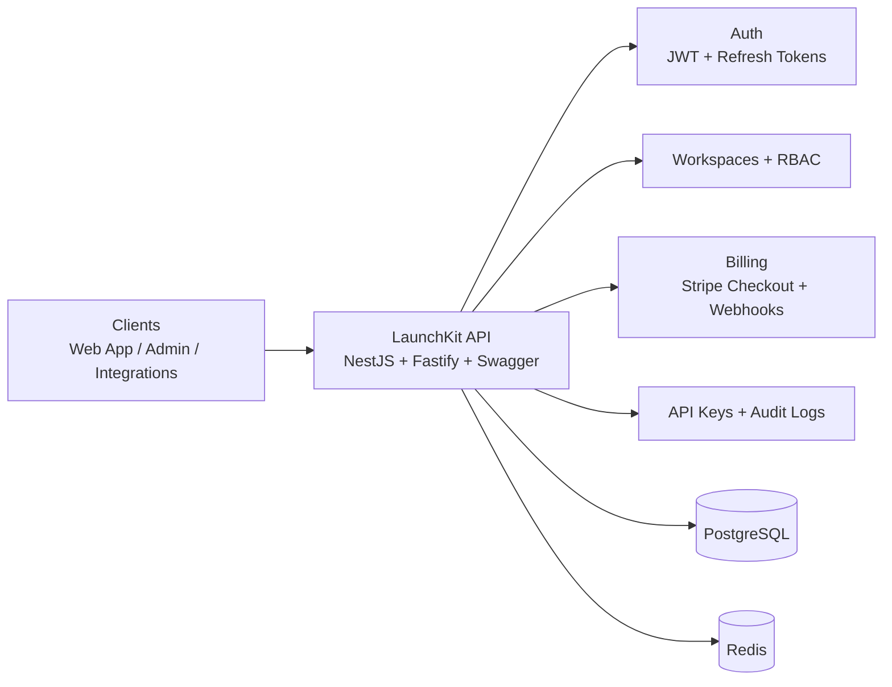
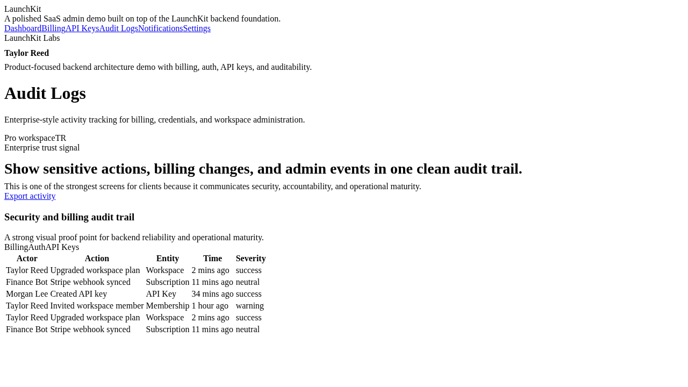

# LaunchKit

> Production-ready **NestJS SaaS backend starter** with **Auth, Multi-Tenancy, RBAC, Stripe Billing, API Keys, Audit Logs, and Workspace Notifications**.



LaunchKit is built to showcase the exact backend capabilities startup founders and freelance clients usually need in a modern SaaS product.

## Highlights

- Authentication with JWT access/refresh flows
- Multi-tenant workspaces and memberships
- RBAC-protected workspace operations
- Stripe checkout + webhook subscription sync
- API key lifecycle management
- Audit trails for billing and security events
- Workspace activity/notification feed
- Swagger API docs + Dockerized local setup

## Why this structure is professional

This repository now showcases a **single product repo** with both the backend and a lightweight frontend demo.

The backend remains the primary foundation, and the frontend exists to help clients instantly visualize the SaaS result:

```bash
launchkit/
  src/
    config/
    common/
    modules/
      health/
      auth/
      workspaces/
      billing/
      notifications/
      audit/
    app.module.ts
    main.ts
  apps/
    web/
      app/
      components/
      package.json
  prisma/
  docs/
  portfolio-assets/
  docker-compose.yml
  .env.example
  package.json
  tsconfig.json
```

This makes LaunchKit stronger as a portfolio project because it now shows both the backend architecture and the visible SaaS/admin experience.

## Tech stack

- NestJS
- TypeScript
- Fastify adapter
- Swagger / OpenAPI
- Prisma ORM
- PostgreSQL
- Redis
- Stripe
- Docker Compose

## Current modules

- **Health** — API status endpoint
- **Auth** — Prisma-backed registration, login, token refresh, and profile endpoints
- **Workspaces** — protected tenant/workspace listing and detail endpoints
- **Billing** — protected Stripe checkout, webhook sync, and subscription overview
- **Notifications** — authenticated workspace event feed
- **Audit** — RBAC-protected audit trails
- **API Keys** — creation, listing, and revocation flows
- **Frontend Demo** — polished Next.js admin UI for dashboard, billing, API keys, audit logs, notifications, and workspace settings

## API preview

- API base: `http://localhost:3000/api`
- Swagger docs: `http://localhost:3000/docs`
- Frontend demo: `http://localhost:3001`

## Getting started

### 1. Install dependencies

```bash
npm install
```

### 2. Create environment file

```bash
cp .env.example .env
```

### 3. Start local infrastructure

```bash
docker compose up -d
```

### 4. Generate Prisma client

```bash
npx prisma generate
```

### 5. Seed demo data

```bash
npm run db:seed
```

### 6. Run the API

```bash
npm run dev
```

### 7. Run the frontend demo

```bash
cd apps/web
npm install
npm run dev
```

The frontend will run at `http://localhost:3001` by default when started separately.

## Example endpoints

- `GET /api/health`
- `POST /api/auth/register`
- `POST /api/auth/login`
- `POST /api/auth/refresh`
- `GET /api/auth/me`
- `GET /api/workspaces`
- `GET /api/workspaces/:slug`
- `GET /api/billing/overview/:workspaceId`
- `POST /api/billing/checkout-session`
- `POST /api/billing/webhooks/stripe`
- `GET /api/notifications/:workspaceId/feed`
- `GET /api/audit/:workspaceId/logs`
- `GET /api/api-keys/:workspaceId`
- `POST /api/api-keys`
- `DELETE /api/api-keys/:workspaceId/:keyId`

## API walkthrough

### Register a workspace owner

```bash
curl -X POST http://localhost:3000/api/auth/register \
  -H "Content-Type: application/json" \
  -d '{
    "email": "founder@launchkit.dev",
    "password": "StrongPass123!",
    "fullName": "Ashish Soni",
    "workspaceName": "LaunchKit Labs"
  }'
```

### Login and get tokens

```bash
curl -X POST http://localhost:3000/api/auth/login \
  -H "Content-Type: application/json" \
  -d '{
    "email": "founder@launchkit.dev",
    "password": "StrongPass123!"
  }'
```

### Create a Stripe checkout session

```bash
curl -X POST http://localhost:3000/api/billing/checkout-session \
  -H "Authorization: Bearer <access-token>" \
  -H "Content-Type: application/json" \
  -d '{
    "workspaceId": "<workspace-id>",
    "plan": "PRO"
  }'
```

### Create an API key

```bash
curl -X POST http://localhost:3000/api/api-keys \
  -H "Authorization: Bearer <access-token>" \
  -H "Content-Type: application/json" \
  -d '{
    "workspaceId": "<workspace-id>",
    "name": "Production Integration Key"
  }'
```

## Frontend screenshots

### Landing page


### Dashboard


### Billing


### API Keys


### Audit Logs


## Demo accounts

After seeding, use these accounts in Swagger or API tests:

- **Founder:** `founder@launchkit.dev` / `StrongPass123!`
- **Admin:** `admin@launchkit.dev` / `AdminPass123!`
- **Member:** `member@launchkit.dev` / `MemberPass123!`

## Sample response

```json
{
  "message": "Workspace owner registered successfully",
  "user": {
    "id": "cm_user_123",
    "email": "founder@launchkit.dev",
    "fullName": "Ashish Soni"
  },
  "workspace": {
    "id": "cm_workspace_123",
    "name": "LaunchKit Labs",
    "slug": "launchkit-labs",
    "role": "OWNER",
    "plan": "FREE"
  },
  "session": {
    "accessToken": "<jwt-access-token>",
    "refreshToken": "<jwt-refresh-token>"
  }
}
```

## What this demonstrates

LaunchKit is designed to signal the backend skills clients usually hire for:

- designing a clean SaaS-ready backend architecture
- implementing secure authentication and session handling
- structuring multi-tenant products with workspace isolation
- enforcing RBAC for sensitive business operations
- integrating Stripe subscriptions and webhook flows
- managing API credentials for external integrations
- recording auditable security and billing events
- building maintainable NestJS services that teams can extend

## Ideal use cases

LaunchKit is a strong fit for projects like:

- SaaS MVPs
- subscription-based platforms
- AI SaaS backends
- internal admin systems
- B2B products with roles and permissions
- startup products needing billing, auth, and tenant architecture

## Documentation

LaunchKit now includes a more complete documentation set for technical review, client presentation, and architecture discussion.

- `docs/index.md` — documentation index
- `docs/architecture.md` — full system architecture
- `docs/hld.md` — high-level design
- `docs/lld.md` — low-level design
- `docs/data-model.md` — entity and relationship model
- `docs/request-flows.md` — key request and business flows
- `docs/api-showcase.md` — portfolio-ready API flows
- `docs/stripe-billing.md` — Stripe billing and webhook design
- `docs/ci.md` — GitHub Actions workflow overview
- `docs/demo-data.md` — demo accounts and seeded records
- `docs/github-launch-checklist.md` — GitHub setup checklist
- `docs/social-preview.md` — social preview guidance
- `docs/roadmap.md` — future expansion ideas
