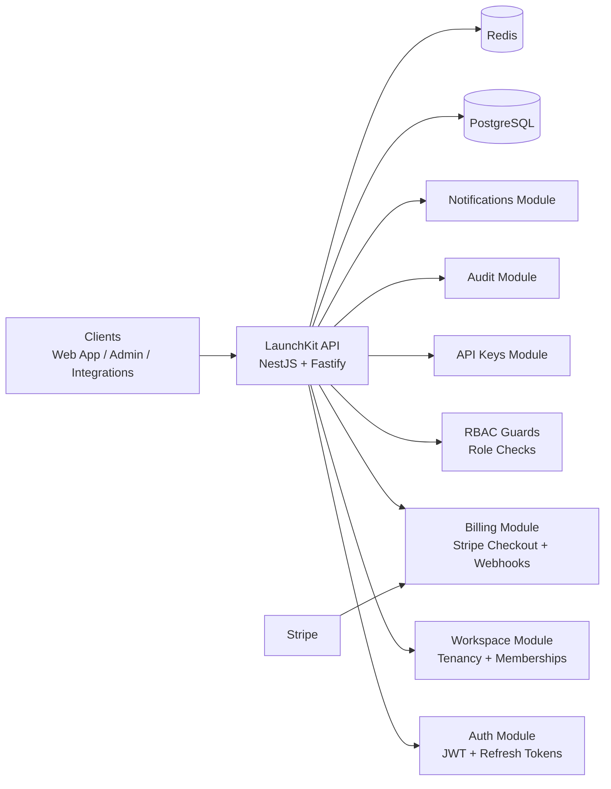
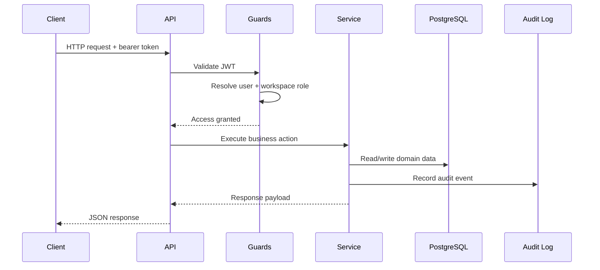
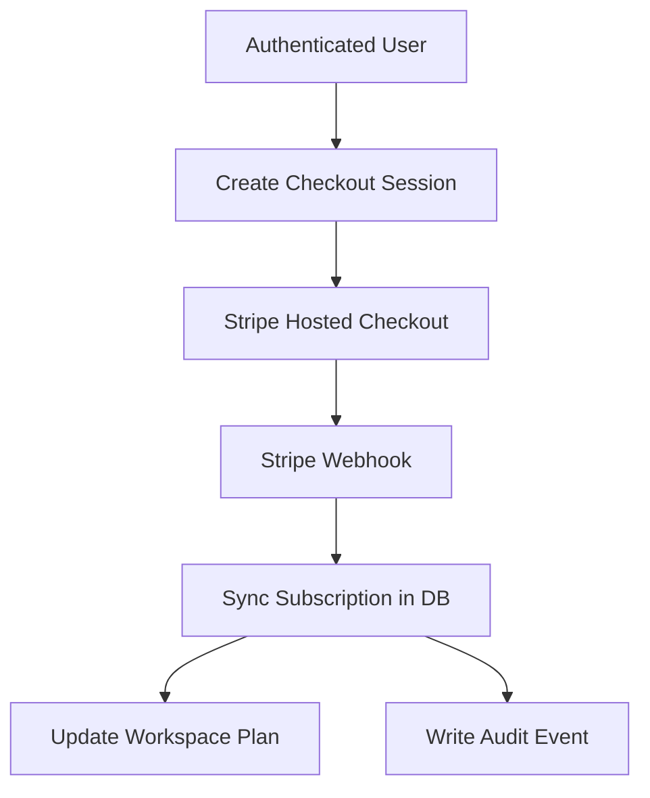

# LaunchKit Architecture

LaunchKit is a **multi-tenant SaaS backend starter** designed to showcase production-style backend engineering for startup and freelance client work.

---

## 1) System Overview

---

## 2) Design Goals

- present a **real SaaS backend structure** instead of a tutorial app
- support **workspace-based multi-tenancy**
- model **production-critical flows** like billing, auth, and audit trails
- keep the architecture **modular and easy to extend**
- demonstrate patterns relevant to **paid client work**

---

## 3) Core Architectural Decisions

### Single-service backend
LaunchKit uses a single NestJS service rather than splitting into many repos or services too early.

**Why:**
- cleaner GitHub presentation
- simpler local setup
- easier for clients to understand quickly
- enough structure to grow into workers/microservices later

### Modular domain boundaries
Each business capability lives in its own module:
- Auth
- Workspaces
- Billing
- API Keys
- Audit
- Notifications

**Why:**
- clearer ownership boundaries
- easier testability
- safer extension over time

### Database-first SaaS modeling
Prisma models define the business foundation:
- users
- workspaces
- memberships
- subscriptions
- API keys
- audit logs

**Why:**
- shows real backend modeling skill
- supports tenancy and billing naturally
- keeps domain relationships explicit

---

## 4) High-Level Request Lifecycle

---

## 5) Multi-Tenancy Model

LaunchKit uses a **workspace-based tenancy model**.

### Rules
- a user can belong to multiple workspaces
- each workspace has many members
- a member has a role within that workspace
- sensitive actions are checked against workspace role membership

### Benefits
- suitable for B2B SaaS
- supports teams, organizations, and client accounts
- scales better than single-user product assumptions

---

## 6) RBAC Model

Current workspace roles:
- `OWNER`
- `ADMIN`
- `MEMBER`
- `BILLING_MANAGER`

### Example access mapping
| Capability | Owner | Admin | Billing Manager | Member |
|---|---:|---:|---:|---:|
| View workspace | ✅ | ✅ | ✅ | ✅ |
| Create API key | ✅ | ✅ | ❌ | ❌ |
| Revoke API key | ✅ | ✅ | ❌ | ❌ |
| View audit logs | ✅ | ✅ | ✅ | ❌ |
| Billing checkout | ✅ | ✅ | ✅ | ❌ |

---

## 7) Billing Architecture

LaunchKit integrates Stripe as the subscription provider.

### Billing flow

### What this demonstrates
- hosted checkout integration
- webhook-driven state sync
- tenant-linked subscription metadata
- plan updates backed by persistence

---

## 8) Security Architecture

### Authentication
- JWT access tokens
- refresh token rotation
- hashed stored refresh token
- password hashing via Node crypto

### Authorization
- bearer-token guard
- workspace membership verification
- role-based authorization for protected operations

### Sensitive resources
- API keys are stored as **hashes**, not plain values
- audit logs preserve security-sensitive events
- Stripe webhooks are designed for signature validation flow

---

## 9) Persistence Layer

### PostgreSQL stores
- users and identities
- workspaces and memberships
- subscriptions and plans
- API keys metadata + hashes
- audit events

### Redis is intended for
- caching
- queues
- websocket/session scaling
- future async processing

---

## 10) Current Boundaries vs Future Growth

### Already implemented
- auth foundation
- workspace tenancy
- RBAC guard patterns
- Stripe checkout + webhook sync foundation
- API key lifecycle
- audit logs
- notification feed from activity data

### Natural next extensions
- BullMQ background jobs
- websocket gateway
- email verification and reset flows
- billing portal
- usage metering
- test suite and CI expansion

---

## 11) Why This Architecture Is Attractive to Clients

Clients usually do not care about abstract complexity. They care whether you can build:
- secure auth
- team-based SaaS apps
- billing-enabled platforms
- admin and operations features
- long-term maintainable systems

LaunchKit is intentionally shaped to prove exactly that.
