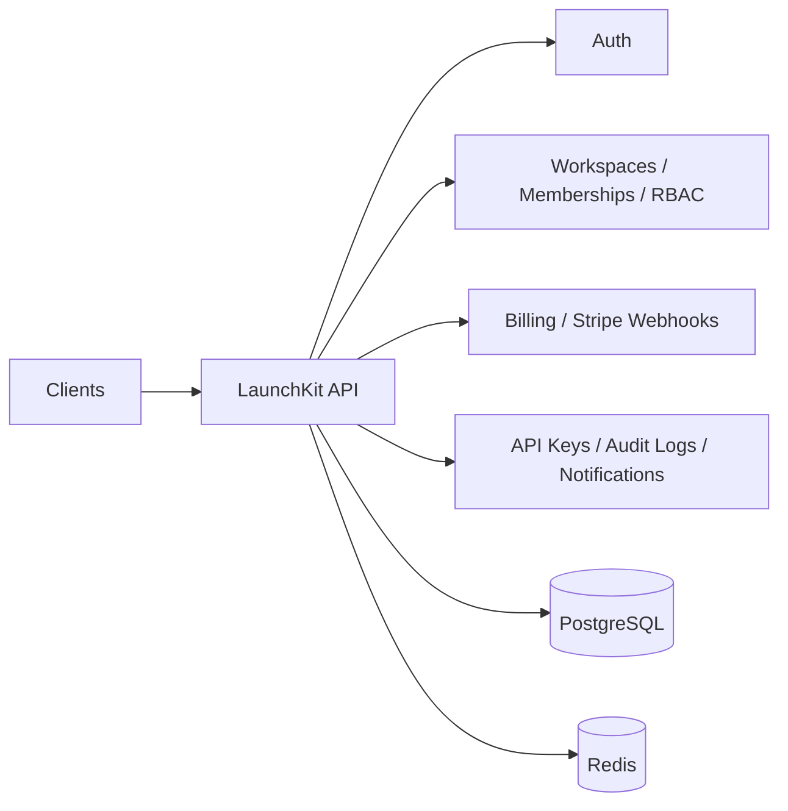

# LaunchKit Architecture

## Goal

LaunchKit is a multi-tenant SaaS backend starter intended for portfolio and freelance positioning.

## High-level components

- **API Layer**: NestJS application exposing REST endpoints
- **Tenant Layer**: workspace-based isolation model
- **Billing Layer**: Stripe subscription orchestration
- **Auth Layer**: JWT, sessions, password reset, OAuth-ready flows
- **Async Layer**: queue workers for emails, usage aggregation, webhook retries
- **Realtime Layer**: notification/event delivery
- **Persistence Layer**: PostgreSQL + Redis

## Planned request flow

1. Client authenticates
2. Access token carries user identity
3. Workspace context is resolved
4. Guards validate role/permission
5. Service executes domain logic
6. Audit event is emitted
7. Usage counters are updated

## Planned domain modules

- Auth
- Users
- Workspaces
- Memberships
- Roles / Permissions
- Billing
- Usage
- API Keys
- Notifications
- Audit Logs
- Webhooks
- Jobs

## Future production upgrades

- Prisma ORM integration
- BullMQ workers
- Stripe webhook signature validation
- centralized exception filters
- structured logging
- metrics and tracing
- integration tests
