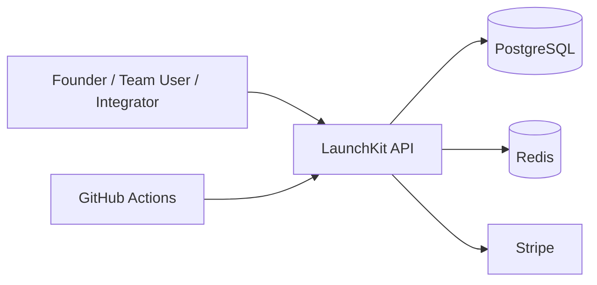

# LaunchKit HLD (High-Level Design)

This document describes LaunchKit from a **solution architecture** perspective.

---

## 1. Purpose

LaunchKit is a backend foundation for subscription SaaS products that need:
- user authentication
- multi-tenant workspaces
- role-based permissions
- Stripe billing
- API credentials for integrations
- auditable business actions

---

## 2. Functional Scope

### Included
- registration and login
- token refresh
- workspace listing and access
- billing overview
- Stripe checkout session creation
- Stripe webhook handling
- API key creation/revocation
- audit log retrieval
- notification feed retrieval

### Intended future scope
- billing portal
- usage limits
- background jobs
- email workflows
- websocket events
- SSO / OAuth expansion

---

## 3. External Interfaces

### Client-facing
- REST API over HTTP
- Swagger documentation

### Third-party
- Stripe Checkout
- Stripe Webhooks

### Infrastructure
- PostgreSQL
- Redis
- Docker Compose
- GitHub Actions CI

---

## 4. Context Diagram

---

## 5. Logical Containers

### API container
Responsible for:
- routing
- validation
- auth
- RBAC
- business orchestration
- persistence coordination

### Database container
Responsible for:
- tenancy data
- user identity records
- subscription records
- API key metadata
- audit logs

### Redis container
Reserved for:
- cache
- queueing
- scalable notifications

### Stripe container
Responsible for:
- hosted checkout
- subscription lifecycle events

---

## 6. Non-Functional Design Intent

- **Maintainability**: modular NestJS services
- **Scalability**: clear module boundaries and Redis-ready architecture
- **Security**: role guards, hashed secrets, audit trail support
- **Reliability**: CI workflow and deterministic seed setup
- **Portfolio clarity**: strong business-oriented feature set

---

## 7. Success Criteria

LaunchKit succeeds as a showcase if a client quickly understands that it supports:
- SaaS product foundations
- secure multi-user backends
- billing and subscription flows
- internal/admin-level controls
- extensible architecture for real projects
