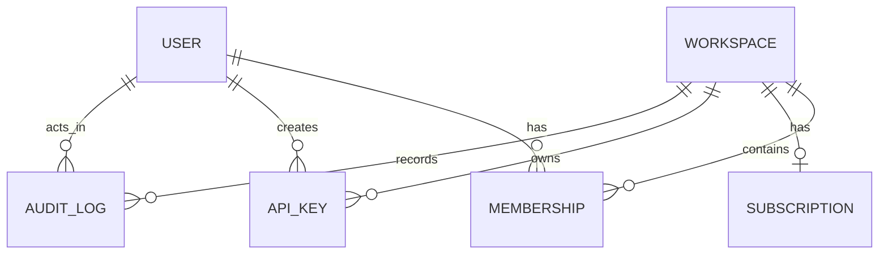
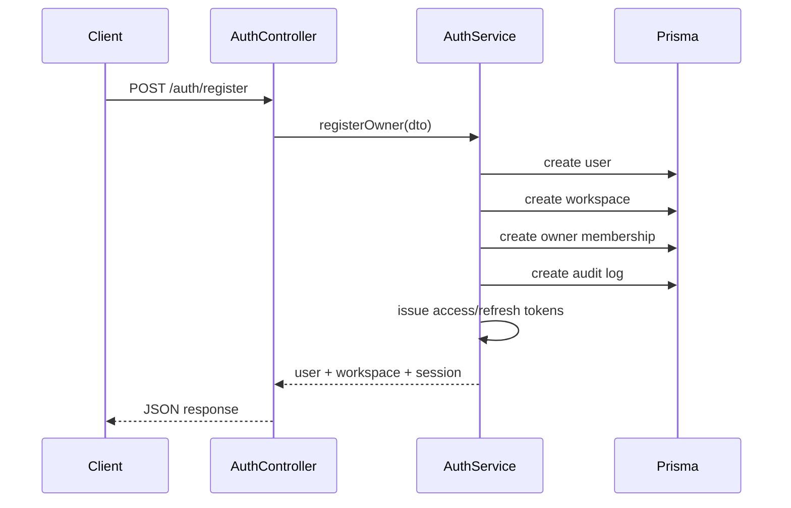
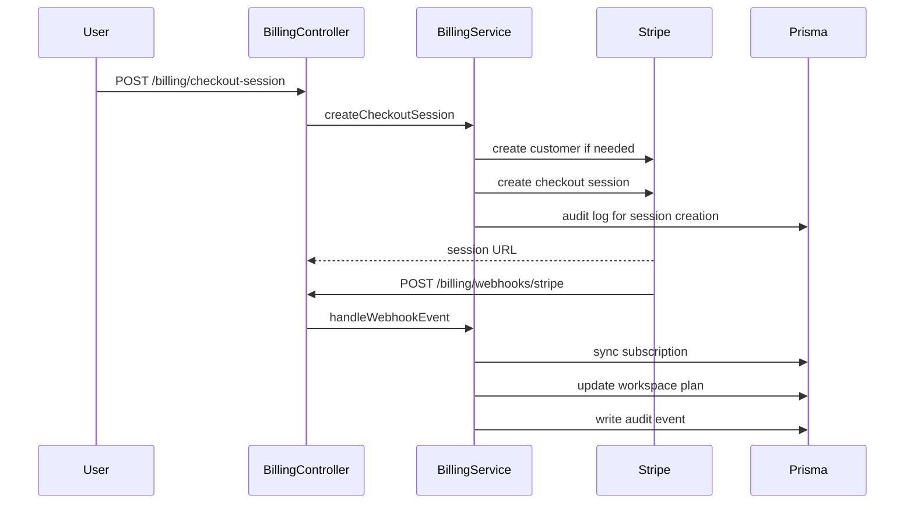

# LaunchKit LLD (Low-Level Design)

This document describes LaunchKit at the service, module, and data interaction level.

---

## 1. Module Breakdown

### Auth Module
Responsibilities:
- register owner account
- create initial workspace
- issue JWT tokens
- rotate refresh token
- return authenticated profile

Key files:
- `src/modules/auth/auth.controller.ts`
- `src/modules/auth/auth.service.ts`
- `src/modules/auth/dto/*`

### Workspaces Module
Responsibilities:
- list user-accessible workspaces
- load workspace details by slug
- return members and subscription context

### Billing Module
Responsibilities:
- billing overview
- checkout session creation
- Stripe customer handling
- Stripe webhook verification and subscription sync

### API Keys Module
Responsibilities:
- list workspace keys
- create hashed API keys
- revoke keys
- record audit entries

### Audit Module
Responsibilities:
- return security-sensitive activity history
- restrict access by role

### Notifications Module
Responsibilities:
- expose recent workspace activity feed
- map audit-style actions to readable titles

---

## 2. Shared Infrastructure Components

### `PrismaService`
Provides:
- database connectivity
- lifecycle startup/shutdown hooks

### `JwtAuthGuard`
Provides:
- bearer token verification
- request user injection

### `WorkspaceRoleGuard`
Provides:
- workspace membership enforcement
- role-based access checks against metadata

### Utility helpers
- `password.util.ts` — password hashing/verification
- `slug.util.ts` — workspace slug creation
- `api-key.util.ts` — key generation + hashing
- `stripe.service.ts` — Stripe SDK wrapper

---

## 3. Core Entity Relationships

---

## 4. Registration Flow

---

## 5. Billing Sync Flow

---

## 6. API Key Creation Flow

1. authenticated user calls `POST /api/api-keys`
2. JWT guard validates identity
3. workspace role guard checks owner/admin role
4. service generates raw token and prefix
5. only token hash is stored
6. audit log is written
7. raw token is returned once

---

## 7. Important Implementation Notes

- refresh tokens are re-issued and re-hashed
- API key plaintext is never persisted
- RBAC is driven by workspace membership role
- notification feed currently derives from audit/activity events
- Stripe metadata carries workspace linkage for sync

---

## 8. Best Candidates for Further Refinement

- request-scoped tenant resolver
- custom exception filters
- DTO response contracts
- integration tests per module
- queue-backed webhook retry handling
- websocket notifications for near-real-time events
